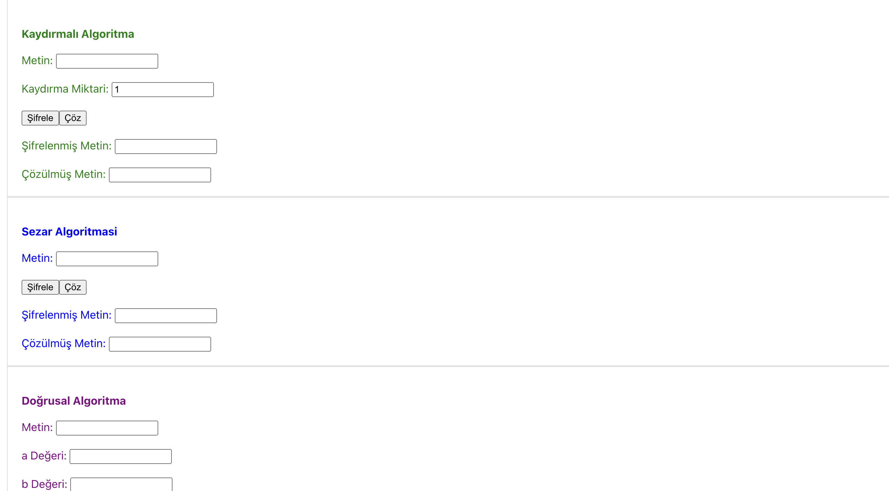

# Şifreleme Algoritmaları Projesi

Bu proje, çeşitli şifreleme yöntemlerini içerir ve kullanıcıların farklı algoritmalarla metin şifrelemelerini ve şifre çözmelerini sağlar. Proje, kriptografi alanına ilgi duyanlar için temel şifreleme tekniklerini öğrenme ve uygulama fırsatı sunar.

## Desteklenen Şifreleme Algoritmaları

### 1. **Doğrusal Şifreleme**

- Doğrusal şifreleme, harfleri belirli bir doğrusal matematiksel formül ile dönüştürerek şifreler.
- Örneğin: Her harf, belirli bir formüle göre alfabede yeni bir harf ile değiştirilir.

### 2. **Kaydırmalı (Shift) Şifreleme**

- Harflerin alfabede sabit bir sayı kadar kaydırılmasıyla yapılan basit bir şifreleme türüdür.
- Caesar şifresi gibi yöntemlerle benzerlik taşır.

### 3. **Rota (Rotasyonel) Şifreleme**

- Belirli bir rotasyon mantığıyla harflerin yer değiştirmesini sağlar.
- Genellikle her karakteri belli bir rotasyon (örn. 13 karakter) ile yer değiştirir. En bilinen örneği **ROT13** algoritmasıdır.

### 4. **Caesar Şifreleme**

- Alfabedeki harflerin belirli bir sabit sayı kadar kaydırılması ile yapılan en temel şifreleme algoritmalarından biridir.
- Örneğin, 3 karakter kaydırma ile `A` harfi `D` olur, `B` harfi `E` olur.



### 5. **Vigenere Şifreleme**

- Caesar şifresinin daha gelişmiş bir versiyonudur ve bir anahtar kelimeye göre her harf farklı bir miktarda kaydırılır.
- Şifreleme, anahtar kelimenin her harfine göre yapılan kaydırmalar ile gerçekleştirilir.

### 6. **Yer Değiştirme Şifreleme**

- Metin içindeki harflerin belirli bir desen veya kurala göre yerlerinin değiştirilmesiyle yapılır.
- Harflerin sırasını değiştirerek yeni bir şifreli metin oluşturur.

### 7. **Yerine Koyma (Substitution) Şifreleme**

- Her harfi belirli bir başka harf ile değiştirme yöntemi ile yapılan şifreleme türüdür.
- Örneğin, `A` harfi her zaman `Z`, `B` harfi `Y` gibi farklı bir harf ile değiştirilir.

### 8. **Permütasyon Şifreleme**

- Metin karakterlerinin yer değiştirme işlemleri ile yapılır. Her karakter belirli bir permütasyon düzenine göre yeniden sıralanır.
- Genellikle sıralama, karmaşık bir desen ya da şifreleme anahtarına göre yapılır.

## Kullanılan Teknolojiler

- **REACT**: Algoritmaların çalışması için, Basit kullanıcı arayüzü sağlamak için.

## Kurulum

Projeyi yerel olarak çalıştırmak için:

1. Bu projeyi klonlayın:
   ```bash
   git clone https://github.com/kullanici/sifreleme-algoritmalari.git
   ```
